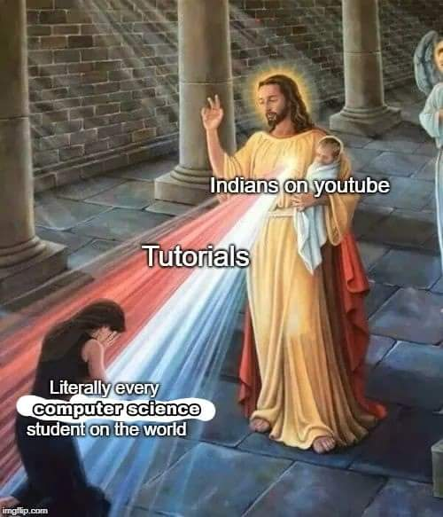
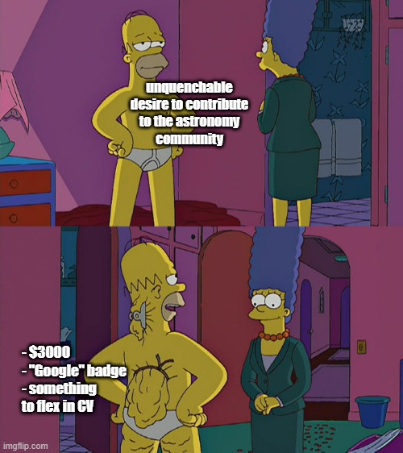
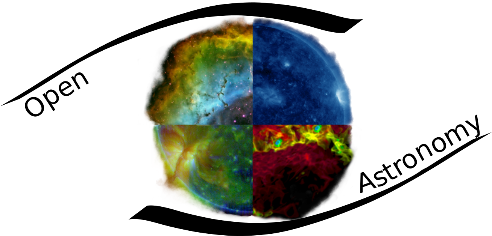

During Spring 2021, I got to know about GSOC, which was something that had the badge "Google" attached on it, while providing a generous amount of money that is equivalent to my already-generous scholarship stipend. I jumped into the application, only to be shocked by the sheer competition in every corner of every organization, where the Indian CS Gods flexed their shinny CVs and backgrounds. I backed up. Like a coward. No excuse.

Spring 2022 came and I had quite a considerable determination to score this year's GSOC. Unlike last year's pathetic attempt, I prepared myself well by reading a bunch of how-to-stop-being-a-whimp-and-get-yourself-a-slot-in-GSOC kind of thing, practiced some coding, and jumped into the organization list. This year, it was indeed different, just not as I expected. As everyone above 18 can apply this year instead of student-only like last year, now not only the Indian CS Gods, but we also have graduated/working developers with extensive amount of experience, and some Chinese guys from Tsinghua University joining the show. Talking about Chinese guys, if you ever watched [Steven He](https://www.youtube.com/c/StevenHe) on Youtube, you would definitely know how OP the Chinese guys are - they are the real Asians, not us Bsians. I once saw an undergraduate guy from Tsinghua Uni - top 1 university of the whole China Mainland - whose several papers got published recently. Truly a little peer pressure out there man!

So anyway I started applying and praying as each day passed. Then on May 21 (JST) for some reason I was announced that I got selected, and so the reason why I am sitting here writing these stuffs. There were a lot of things happened internally, from the application phase, the waiting time, until the moment I knew I was selected. But whatever happens, know I only have one focus, which is to nail this summer's project and make a huge, memorable contribution to RADIS and GSOC this year.

So basically, my project is about fitting spectrums based on benchmarking process. So far, RADIS is a fast line-by-line code featuring synthesis, processing and analysis of high-resolution infrared absorption and emission molecular spectra, under both equilibrium and nonequilibrium conditions. The goal of my project is to improve the RADIS fitting process to reduce the fitting time, by optimizing its models, fitting methods and other features under different reference cases. To accomplish this, I will create a massive database of labelled spectra as reference cases, run various benchmarks with different fitting settings to evaluate their impact on fitting performance, and finally implement the best acceptable settings into RADIS codebase. This project also features enhancement of fitting process by implementing RADIS native features such as caching spectra, local databases, and GPU-augmented calculation. Basically, you can read my project proposal [here](https://github.com/radis/radis/wiki/GSOC-2022-Application-RADIS-Tran-Huu-Nhat-Huy:-Spectrum-Fitting-Improvement).

