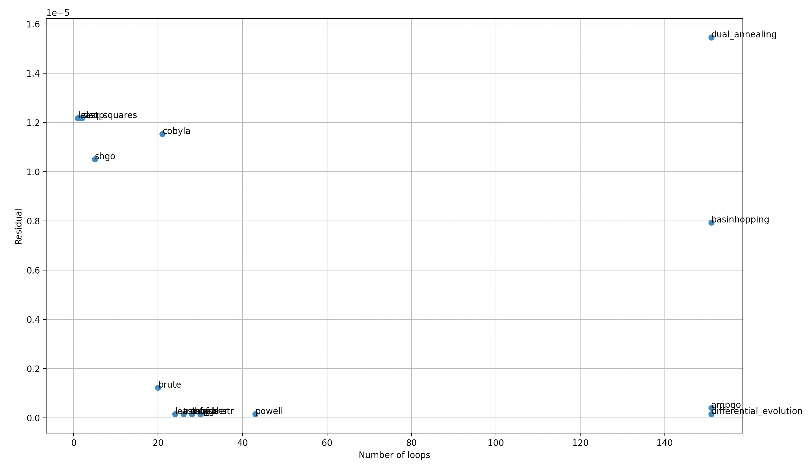

### 1. Implementation of modules into RADIS

Finally, after being approved by Mr. Erwan, I can implement all of my modules, developed separately in my repo [RADIS-Spectrum-Fitting-Benchmark](https://github.com/TranHuuNhatHuy/RADIS-Spectrum-Fitting-Benchmark), into RADIS codebase. The implementation features [`new_fitting.py`](https://github.com/radis/radis/blob/develop/radis/tools/new_fitting.py), the new fitting module that stores all the fitting functions and associated models, whose performance confirmed after a bunch of user-testing cases. 

### 2. Accompanied illustrative examples

They are gallery examples that are added into `radis/examples`, serving as illustrative scripts for my new fitting module:

#### (i) `plot_newfitting_Tgas.py`

The most basic example of how to use new fitting module, including the formats and so on.

#### (ii) `plot_newfitting_Trot-Tvib-molfrac.py`

The real-life fitting case provided by Mr. Corentin, featuring non-LTE CO spectrum in which we will fit `Trot`, `Tvib` and `mole_fraction`.

#### (iii) `plot_newfitting_Tgas-molfrac.py`

Mr. Minou's user-testing case of CO absorbance spectrum near 2011 cm-1. This case features spectrum extraction from a `.mat` MATLAB file. Originally, this file was 1.2 MB, quite large to be added to RADIS. Thus, I removed all fields unnecessary for spectrum generation, and now it only has around 400 kB left.

#### (iv) `plot_newfitting_comparison_oldnew.py`

Performance comparison example between [current 1-temperature fitting](https://radis.readthedocs.io/en/latest/auto_examples/plot_1T_fit.html#sphx-glr-auto-examples-plot-1t-fit-py) and my new fitting module, under exactly the same ground-truths and settings. The benchmark result shows that, under exactly the same conditions, the new best fitted value differ 0.45% from the old one (1464.1 K from the old 1457.5 K). New fitting module requires half as many iterations as the old one and hence faster, with much smaller residual. In detail:

````
====================  PERFORMANCE COMPARISON BETWEEN 2 FITTING METHODS  ====================

1. LAST RESIDUAL

- Old 1T fitting example:       0.002730027027336094
- New fitting module:           0.0005174179496843629

2. NUMBER OF FITTING LOOPS

- Old 1T fitting example:       32 loops
- New fitting module:           16 loops

3. TOTAL TIME TAKEN (s)

- Old 1T fitting example:       4.881942987442017 s
- New fitting module:           2.7344970703125 s

==========================================================================================
````

I'm not sure this superiority will persist in all cases, but even so, I believe the value of my module still lies in its practical and easy to use/apply.

#### (v) `plot_newfitting_comparison_methods.py`

A benchmarking example which compares performance between different [LMFIT fitting algorithms](https://lmfit.github.io/lmfit-py/fitting.html#choosing-different-fitting-methods). It measures their last residual (for accuracy evaluation) and number of iterations (for robustness evaluation). The benchmark result shows that, under exactly the same conditions, `leastsq` and `lbfgsb` work best, with `leastsq` good at accuracy, while `lbfgsb` good at speed (and theoretically, memory requirement). Thus, I set `leastsq` as default method for the module, but also encourage users to switch to `lbfgsb` in case things turn sour.

````
======================== BENCHMARKING RESULT ========================

||           METHOD          ||          RESIDUAL         || LOOPS ||
||---------------------------||---------------------------||-------||
|| leastsq                   || 1.4739494411950239e-07    || 24    ||
|| least_squares             || 1.2170348021620847e-05    || 1     ||
|| differential_evolution    || 1.4739855740762716e-07    || 151   ||
|| brute                     || 1.2287258962300115e-06    || 20    ||
|| basinhopping              || 7.930954059631543e-06     || 151   ||
|| ampgo                     || 4.105104127826488e-07     || 151   ||
|| nelder                    || 1.4739942144030064e-07    || 30    ||
|| lbfgsb                    || 1.4739494411955646e-07    || 28    ||
|| powell                    || 1.473949441200994e-07     || 43    ||
|| cg                        || 1.4776331905574135e-07    || 30    ||
|| cobyla                    || 1.1524288718226295e-05    || 21    ||
|| bfgs                      || 1.4776331905574135e-07    || 30    ||
|| tnc                       || 1.4740393115424221e-07    || 28    ||
|| trust-constr              || 1.4739494411948182e-07    || 26    ||
|| slsqp                     || 1.2170348021620847e-05    || 2     ||
|| shgo                      || 1.0507694502308952e-05    || 5     ||
|| dual_annealing            || 1.5455930218501237e-05    || 151   ||
||---------------------------||---------------------------||-------||
````

