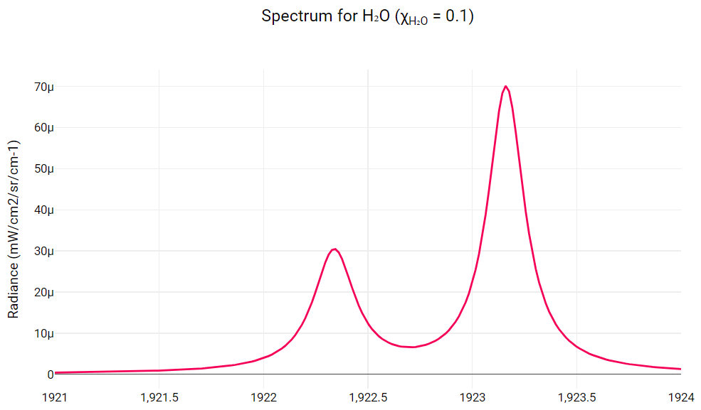

So, according to the plan, in the first week I am supposed to finish these tasks:

- Setup a dedicated repository for reference database. Upload gathered spectra labelled with ground truths onto the database.
- Investigate and understand each spectra type’s nature, identification and complexity, under instructions of mentors.
- Prepare LMFIT modules for benchmarking process.

First is about a dedicated repository for reference database. Since my project is about creating a brand-new feature for RADIS users instead of making changes in RADIS codebase to increase its performance of already-implemented features, I have to do all of my work in a separated repository, before committing to the main codebase upon mentor's approval. Thus, I have created [RADIS Spectrum Fitting Benchmark repository](https://github.com/TranHuuNhatHuy/RADIS-Spectrum-Fitting-Benchmark) specifically built for benchmarking process of RADIS spectrum fitting. This repository contains the spectra library with their curresponding ground-truths, as well as fitting modules and benchmarking results.

The next step is to gain more knowledge and understanding regarding the spectrum types, and nature of each of them. So basically, now I'm expected to conduct extensive benchmarking process on 4 spectrum types and find now which pipeline fits best on which spectrum type. For now, the classification of spectrum is:

1. Large spectra: spectra containing a lot of data points, maybe because there are too many lines that fill up the RAM capacity during spectrum calculation, or because spectrum's coverage on large wavelength/wavenumber ranges (which also means "wide" spectra), leading to various empty spaces that can be optimized. Either way, the calculation step of these spectra is extensively heavy, both in time and memory required.


2. Narrow spectra: spectra containing small amount of data points, in which lineshape can be line-wise calculated without the need of extensive collissional broadening.



3. LTE spectra: spectra featuring only gas temperature *Tgas*, basically the major type of spectrum usually encountered throughout multiple experiments. This type of spectrum can be derived using RADIS's equilibrium claculation.
4. Non-LTE spectra: spectra featuring multiple temperatures, not only gas temperature *Tgas* but also vibrational temperature *Tvib* and rotational temperature *Trot*. RADIS's non-equilibrium calculation is required to calculate these spectra.

In this project, I am expected to optimize these 4 types of spectrum. There are several optimization ideas that can be utilized and developed upon:

1. For large spectra: as this type of spectrum has significant burden in the model calculation, a lot of rooms for improvement can be found in this process. For this, we can try to reduce the solution of experimental and model spectra for shorter calculation time, or we can even normalize them, since lineshape heavily relies on temperature components.
2. For small spectra: as this type of spectrum has few data points, while the calculation process is very fast, the burden one is actually spectrum generation phase. Visualization of spectrum is convenient for human, but not for machine and the cost function. So, we can by-pass this spectrum generation process and just only focus on the calculation side.
3. For LTE and Non-LTE spectra, the difference is all about the number of fitting parameters, and the choice of fitting users regarding fitting boundaries and dependencies. We can flexibly adapt these kinds of fitting pipelines.

Finally is the tentative format for my brand-new fitting module. Have been in this spectroscopy community for months, I notice a lot of times newcomers arrive and get confused at the RADIS installation and its codebase. To add up, current [RADIS fitting example](https://radis.readthedocs.io/en/latest/auto_examples/plot_1T_fit.html) is quite challenging, especially for new users of RADIS. 

So, when designing new fitting feature from the perspective of user experience, I want to make a user-friendly interface that can benefit both. Thus, my idea is a fitting module that:

- Users only need to fill the fitting conditions and parameteres into something like a JSON file, along with a *.spec* Spectrum file containing the experimental spectrum to be fitted. Basically, a JSON file is going to be like this:

```json
{
  "fileName": "CO2-1-1900-2300-cm-1.01325-t300-v300-r300-p1-sl0.5nm.spec",
  "molecule": "CO2",
  "isotope": "1",
  "from_wavelength": 1900,
  "to_wavelength": 2300,
  "pressure": 1.01325,
  "mole_fraction": 0.1,
  "path_length": 1,
  "slit": "0.5 nm",
  "fit": {
    "Tgas": 300,
    "Tvib": 300,
    "Trot": 300,
  }
}
```

- The fitting module will read the JSON file and acquire the information, while loading the experimental spectrum.
- The whole fitting process is automatically conducted. Everything users need to do, is to fill out a JSON form, and prepare an experimental file. This is much more user-friendly instead of the above fitting example, where users have to manually define the model, refine experimental spectrum and other things.

With all of this, I really hope to bring forth a brand-new fitting experience for RADIS users. Ambitions are set, now sit tight, and start coding!