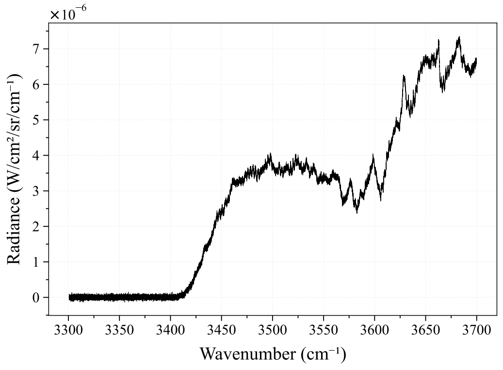

According to the project proposal, during the second week I am supposed to start the benchmarking process with a bunch of large-category synthentic spectra. Thus, I started to generate a bunch of large synthetic spectra. 

Firstly, I create a [synthetic spectrum generator](https://github.com/TranHuuNhatHuy/RADIS-Spectrum-Fitting-Benchmark/blob/main/data/synthetic_spectrum_generator.py). This module is to synthesize various spectra for the benchmarking process based on 4 groups:

- Large and LTE spectra.
- Large and non-LTE spectra.
- Narrow and LTE spectra.
- Narrow and non-LTE spectra.

Generated spectra are stored in `./data/<spectrum-type>/spectrum` in RADIS .spec file, while their corresponding ground-truths are stored in `./data/<spectrum-type>/ground-truth` in JSON format. For each spectrum type, after acquiring most stable fitting pipeline, the model, the algorithm and other specific settings will be stored as a model file in `./fitting-module/<spectrum-type>/model.py`.

For example, I want to generate a synthetic LTE spectrum whose ground-truth as:

- Molecule: CO2.
- HITRAN isotope ID: 1 (12C16O2).
- Wavelength range: from 3300 cm-1 to 3700 cm-1.
- Pressure: 0.005 bar.
- Tgas: 3000 C.
- Mole fraction: 0.01
- Path length: 1 cm.
- Experimental slit: 1.4 mm.

Then, the JSON generated and registered for this spectrum is going to be like this:

```json
{
  "fileName": "synth-CO2-1-3300-3700-cm-1-P0.005-t3000-v-r-mf0.01-p1-sl1.4nm.spec",
  "molecule": "CO2",
  "isotope": "1",
  "wmin": 3300,
  "wmax": 3700,
  "wunit": "cm-1",
  "pressure": 0.005,
  "mole_fraction": 0.01,
  "path_length": 1,
  "slit": "1.4 nm",
  "fit": {
    "Tgas": 3000,
    "bound_Tgas": [
      2500,
      4000
    ]
  }
}
```

As you can see, the `fileName` specifies `.spec` file - the file which stores our experimental spectrum - in the data directory. Other parameters can be seen above. For the `fit` group, it contains fit parameters, initial fitting value, and the fitting boundaries. For example, in the JSON file above, we fit the `Tgas` parameter whose initial value is 3000 C, upper bound and lower bound are 2500 C and 4000 C respectively.

Then, for the given initial conditions, and initial `Tgas` value, we have this RADIS-calculated spectrum:


To make it look like an experimental one, after applying slit and around 0.2 mm of offset, noises will be added with scale at 1% of max radiance value. 

```python
s_wav, s_val = s.get('radiance')
noise_scale = max([val for val in s_val if not(math.isnan(val))]) * 0.005 # Prevent NaN
s_val += np.random.normal(size = s_val.size, scale = noise_scale)
```

Then, I reproduce dilatation by applying non-linear transformation, with scale 0.66% of deviation.

```python
wav_mean = np.mean([wav for wav in s_wav if not(math.isnan(wav))])
s_wav = wav_mean + (s_wav - wav_mean) * 1.0066
```

Finally, the noise-added spectrum will be save as .spec file and its information will be stored as formatted JSON structure. The noise-added spectrum is like this:



We can see the difference between these two spectra using `plot_diff()`:


These files will later be used for benchmarking process to test multiple fitting pipelines, and more files will definitely be added later.

About the fitting module, now I am still stuck with the development of it. The development seems harder and requires more time than I expected. I will try my best to keep up with the deadlines.