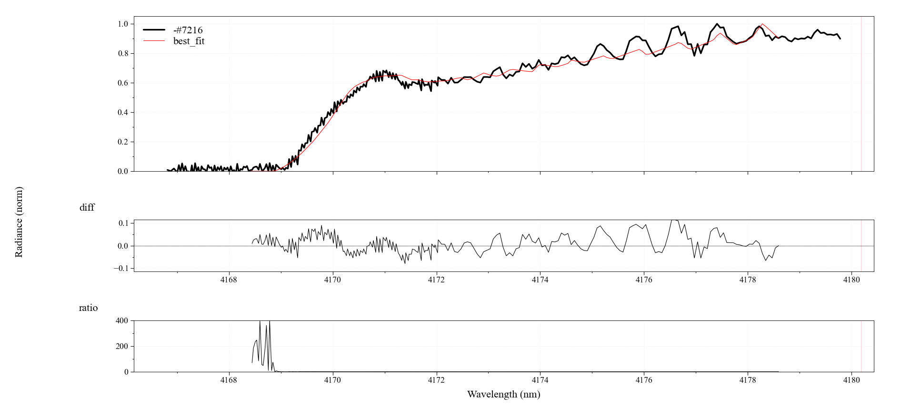

To be honest, I started this week realizing I was far behind the deadline. After suffering a traumatizing fever which incapacitated me for one week, I had a fitting module which did not run correctly. Starting this week, the JSON parsing worked normally, but for some reasons the fitting process kept plummeting the `Tgas` value either to very high or very low guesses, always out of the boundaries. What are they trying to seek? I don't know. So, I have spent this third week trying my best to fix the fitting module and make it run normally:

- At first, I suspected this was a fault in the return of cost function, so I tried either [get_diff()](https://radis.readthedocs.io/en/latest/source/radis.spectrum.compare.html#radis.spectrum.compare.get_diff) or [get_residual()](https://radis.readthedocs.io/en/latest/source/radis.spectrum.compare.html#radis.spectrum.compare.get_residual). The fitting process varied between the two approaches, but in the end the plummeting value prevailed.
- Then, I thought my synthetic spectra were faulty, so I decided to regenerate and restructure them all over again, and the problem was still there.
- At this time I was still believing that the problem came from the difference between two spectra. So I tried my best to put the generation of two spectra as similar as possible, but still no progress.

It was around this point that I received some mind-blowing feedbacks from Mr. Erwan Pannier - one of my mentors:

> Do not wasting time trying to determine a perfect threshold or categories.
>
> Work on real-life examples. CO2 4.2 - 5 µm is one.
>
> CO2 bandhead (the Single Temperature fit example) is another one.
>
> Works on the improving the fits from these real-life examples,
> and - maybe - you'll generalize to categories/classifications eventually.

At some point, I tried to use [normalize()](https://radis.readthedocs.io/en/latest/source/radis.spectrum.spectrum.html#radis.spectrum.spectrum.Spectrum.normalize). My idea is, since my current fitting target is temperature, the experimental and model spectra can be both normalized, as the spectrum lineshape is determined by the component temperatures. After normalizing, things worked perfectly out of my expectation!

And so, after one week of pure suffering and perseverance, I have finished the fitting module! So, there are 3 important parts of my fitting feature:

### 1. Input JSON file

A JSON file containing every information, from path to experimental spectrum file, to initial conditions - known parameters that will be used for calculating model spectra, and fit parameter(s) are also stated here. For example:

```json
{
  "fileName": "CO2_measured_spectrum_4-5um.spec",
  "molecule": "CO2",
  "isotope": "1,2",
  "wmin": 4167,
  "wmax": 4180,
  "wunit": "nm",
  "pressure": 1e-3,
  "mole_fraction": 1,
  "path_length": 10,
  "slit": "1.4 nm",
  "fit": {
    "Tgas": 1100,
    "bound_Tgas": [300, 2000]
  }
}
```

As you can see from the JSON file above:

- `fileName` : path to the `.spec` spectrum file from `./data/`, will be changed when implementing to RADIS codebase. For now the format is `<spectrum-type>/spectrum/<name>.spec`. For example: `large/spectrum/CO2_measured_spectrum_4-5um.spec`.
- Parameters from `molecule` to `slit` are used for calculating model spectrum later. `wmin` and `wmax` are used to determine the range of wavelength/wavenumber that will be cropped from original experimental spectrum.
- `fit` section contains fit parameters and their corresponding initial values or fitting bounds. In the example above, fit parameter `Tgas` has initial value of 1100 and fitting bound [300, 2000].

### 2. Fitting module `fitting_module.py`

Contains functions to load JSON file `get_JSON()` and most importantly, `fit_spectrum()` which receives only path of JSON file as input parameter, and will do all the fitting work for you.

Firstly, when being called, `fit_spectrum()` will call and parse the input path to `get_JSON()` which reads necessary information from the JSON file. These information are returned to `fit_spectrum()`, which will try to retrieve experimental data. Then, it crops, normalizes, removes NaN values, and some other refinements. Next, the read information and refined experimental spectrum will be sent to fitting models for the fitting process, which is described below.

### 3. Fitting models `model_LTE.py` and `model_nonLTE.py`

These 2 files contain `residual_LTE()` - for LTE spectra, and `residual_NonLTE()` - for non-LTE spectra (I haven't developed this yet, will be done this week according to timeline), respectively. These functions receives refined experimental spectrum and initial conditions read from JSON file before, then calculate model spectrum, refine it, and return the residual/difference/cost between 2 spectra.

### 4. Initial result when fitting `CO2_measured_spectrum_4-5um.spec`

I tried to recreate the same fitting scenario as [1-temp fit example](https://radis.readthedocs.io/en/latest/auto_examples/plot_1T_fit.html#sphx-glr-auto-examples-plot-1t-fit-py). The result of my module seems promising, with only 17 iterations compared to 32 iterations in the example.

```
Succesfully finished the fitting process in 7.901483058929443s.
[[Fit Statistics]]
    # fitting method   = leastsq
    # function evals   = 17
    # data points      = 1
    # variables        = 1
    chi-square         = 7.4524e-06
    reduced chi-square = 7.4524e-06
    Akaike info crit   = -9.80697750
    Bayesian info crit = -11.8069775
[[Variables]]
    Tgas:  1459.11902 +/- 26872889.5 (1841720.19%) (init = 1100)
e:\radis\radis\misc\warning.py:354: HighTemperatureWarning: HITRAN is valid for low temperatures (typically < 700 K). For higher temperatures you may need HITEMP or CDSD. See the 'databank=' parameter
  warnings.warn(WarningType(message))
e:\radis\radis\misc\curve.py:241: UserWarning: Presence of NaN in curve_divide!
Think about interpolation=2
  warnings.warn(
```



### 5. RADIS fitting process from user perspective in the future

If being implemented, this fitting pipeline will benefit RADIS users, especially new users, in the future. Imagine you have a spectrum to be fitted. All you need to do next, is to fill the information into a JSON form, and then call `fit_spectrum(<path-to-JSON-file>)` and let it do all the work. If you are not satisfied with the result, you can change the unknown information in the JSON, such as `slit` and `path_length`, and recall the function again, until you are satisfied.

This is way easier and much friendlier for RADIS users than dwelling into RADIS documentation to find out and learn how to use existing fitting pipeline.

For now, this user interface only allows LTE spectra to be fitted. But in the following weeks, more types will be implemented and covered along with results from benchmarking progress.