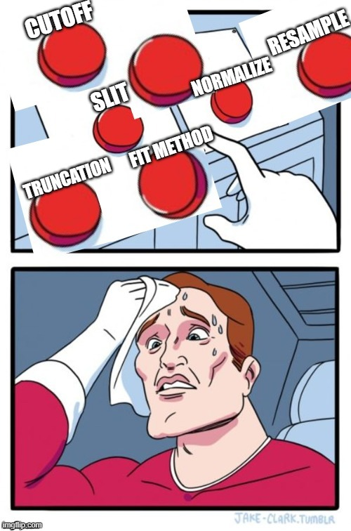

As my fitting module has completed, now I am clear to start the benchmarking process. Initially, I planned to do it on 4 categories: large, small, LTE and non-LTE. But then, Mr. Erwan's words helped me realize that my classification was somehow not ideal for this, as he said:

> The first need is not fitting performance, its a good fitting interface they would work on every typical condition.
>
> Do not wasting time trying to determine a perfect threshold or categories.
>
> Work on real-life examples. CO2 4.2 - 5 µm is one.
>
> CO2 bandhead (the Single Temperature fit example) is another one.
>
> Works on the improving the fits from these real-life examples,
> and - maybe - you'll generalize to categories/classifications eventually.

To be honest, I have been thinking about changing my project timeline and objectives a little bit. Initially, I proposed the timeline in which I would spend 1 week for making the module, and 4 weeks to conduct benchmarking on 4 types of spectrum (large, small, LTE, non-LTE). But then, I encountered a lot of difficulties in conducting the fitting process, which significantly delays my fitting module to be completed in the end of week 3. Along with Mr. Erwan's suggestions, after careful considerations, I have decided to reduce the category to only 2 groups of LTE and non-LTE spectra, and propose a new timeline based on that with my mentors, which successfully acquired their approvals. The new timeline is:

- Week 4 (this week): conduct benchmarking process on LTE spectra.
- Week 5: conduct benchmarking process on non-LTE spectra.
- Week 6: implement the fitting module and fitting models into RADIS codebase, finish any documentations, create a 101 tutorial, and prepare for first evaluation.

For this new timeline, the last week is going to be the toughest time ever! But I will try my best to catch up with the deadlines once and for all. I must admit that after half the first phase, I realized that my expected timeline in my project proposal - derived from my initial understandings of RADIS and fitting - is quite not applicable. As Mr. Minou - one of my mentors, said:

> Don't worry about changing the objectives . Some difficulties usually come up only when the project begins and cannot
> be easily anticipated. New directions seem fine to me and you are on the right path.

As well as Mr. Erwan:

> Just keep on progressing on the project as you do, reevaluating needs if needed.

 I have more confidence in keeping on with my plan. This new approach, hopefully, will allow me to finish implementing the fitting module into RADIS by the end of first phase. Quite an intensive experience for me but, let's go anyway! So here are the benchmarking results for our LTE experimental spectra, in which I will focus on comparison between fitting methods, and between refinement pipelines.

 ### 1. Fitting method benchmarking

 The ideal of benchmarking result is to test and assess under what conditions, such as fitting method, pipeline, refinement, etc., the fitting process can achieve a stable and robust result. Firstly, I want to test the fitting method and see which ones are the best to put into the module as the default method. As we use LMFIT.Minimizer, we have 23 fitting methods in total:

- `leastsq`: Levenberg-Marquardt (default).
- `least_squares`: Least-Squares minimization, using Trust Region Reflective method.
- `differential_evolution`: differential evolution.
- `brute`: brute force method.
- `basinhopping`: Basin-hopping method.
- `ampgo`: Adaptive Memory Programming for Global Optimization.
- `nelder`: Nelder-Mead.
- `lbfgsb`: Limited-memory Broyden–Fletcher–Goldfarb–Shanno (L-BFGS-B).
- `powell`: Powell's method.
- `cg`: Conjugate-Gradient.
- `newton`: Newton-Conjugate-Gradient.
- `cobyla`: Cobyla.
- `bfgs`: Broyden–Fletcher–Goldfarb–Shanno (BFGS).
- `tnc`: Truncated Newton.
- `trust-ncg`: Newton-Conjugate-Gradient trust-region.
- `trust-exact`: nearly exact trust-region.
- `trust-krylov`: Newton's Generalized Lanczos Trust-Region (GLTR).
- `trust-constr`: trust-region for constrained optimization.
- `dogleg`: Dog-leg trust-region.
- `slsqp`: Sequential Linear Squares Programming.
- `emcee`: Maximum likelihood via Monte-Carlo Markov Chain.
- `shgo`: Simplicial Homology Global Optimization.
- `dual_annealing`: Dual Annealing optimization.

In this list, there are 5 methods - `newton`, `trust-ncg`, `trust_exact`, `trust-krylov` and `dogleg` - that require Jacobian function to work, which adds more complexity into our fitting process and codebase, hence I remove them from the benchmark and never use them again. There are also `emcee` method that, for some unknown reasons, the fitting procedure never stops even after passing the loop limit, thus I have to remove it. Now we have 17 methods left that are stable enough to compare. Additionally, I set the max number of fitting loops as 200, so this means that any method that have equal of higher than 200 loops means that they are most likely unable to stop. I will conduct benchmarking process on the `CO2_measured_spectrum_4-5um.spec` first.

The result for this method-comparing benchmark can be found in [this JSON file](./method_comparison.txt).

| Method                 | Last residual   | Number of loops | Processing time (s) |
| :--------------        | :-------------: | :-------:       | :-----------:       |
| leastsq                | 0.0027299042272 | 17              | 6.128568887710571   |
| least_squares          | 0.0027299046347 | 14              | 3.8792104721069336  |
| differential_evolution | 0.0027299042330 | 48              | 7.211840629577637   |
| brute                  | 0.0027847218345 | 20              | 3.13600492477417    |
| basinhopping           | 0.0030471725482 | 201             | 31.650216579437256  |
| ampgo                  | 0.0027301332094 | 201             | 36.60996413230896   |
| nelder                 | 0.0027299042330 | 48              | 7.532714605331421   |
| lbfgsb                 | 0.0027299043815 | 12              | 1.8955962657928467  |
| powell                 | 0.0027299042271 | 38              | 6.310025691986084   |
| cg                     | 0.0027299046922 | 34              | 5.223567724227905   |
| cobyla                 | 0.0027299044752 | 22              | 3.028048515319824   |
| bfgs                   | 0.0027299042351 | 20              | 2.9560532569885254  |
| tnc                    | 0.0027299042284 | 36              | 5.905533313751221   |
| trust-constr           | 0.0027299042271 | 16              | 2.3700413703918457  |
| slsqp                  | 0.0027299969016 | 18              | 3.160074472427368   |
| shgo                   | 0.0027299042272 | 32              | 6.185185194015503   |
| dual_annealing         | 0.0221619241989 | 201             | 32.40411591529846   |

_(It is important to remember that this result might differ for each run, but rest assure the common trend is unchanged)_

As you can see from the data above, we have `basinhopping`, `ampgo` and `dual_annealing` jumping out of the loop limit of 200, and it's totally not a good thing, which I would like to exclude them out for the sake of better visualization. Then, in order to compare the rest of 14 methods, I have a scatter plot below in which I focus on analyzing the `last_residual` - indicator of accuracy - on the horizontal axis, and `loops` - indicator of fitting iterations needed - on the vertical axis. As `time` is heavily influenced by the computational capacity of each device, I don't prioritize it than other two criteria in the result assessment, and thus it is indicated by color code.

If we zoom in the best 8 cases marked by the red rectangle above:

In the zoomed figure, the result is quite satisfying as I expected. When we talk about the most famous curve-fitting algorithms, we can mention either `leastsq`/`least_squares` or `bfgs`/`lbfgsb`, and now we can see them taking 4 out of top 5. Now let's focus on the two competitors: `lbfgsb` and `least_squares` and get some observations:

- `lbfgsb` has a little lower residual and so a little bit better in accuracy than `least_squares`.
- Although approximately same fitting loops (12 and 14), the time required for `lbfgsb` is 1.895596s, significantly lower than `least_squares` of 3.879210s. We can also see this behavior in their neighbors: `bfgs` (2.956053s) < `leastsq` (6.128569s).

This is explainable. While `least_squares` simply calculating and minimizing the sum of the residuals of points from the comparative curves, `lbfgsb` - Limited-memory BFGS uses a limited amount of computer memory to conduct [Broyden-Fletcher-Goldfarb-Shanno algorithm](https://en.wikipedia.org/wiki/Broyden%E2%80%93Fletcher%E2%80%93Goldfarb%E2%80%93Shanno_algorithm) for the minimization.

So for now, I have initial assumption that `lbfgsb` performs slightly better than `leastsq`. After conducting fitting process on other spectra, the `lbfgsb` and `leastsq` are seem to be dominant in terms of speed (based on number of loops and time elapsed) and accuracy (this depends a little bit on pipeline combination, which will be addressed in next part) compared to other methods. However, more benchmarks are needed to confirm my initla assumption.

### 2. Fitting pipeline comparison

Next is the benchmarking process focusing on pipeline comparison. A fitting pipeline comprises of several options, from spectrum refinement methods such as which spectral quantity to take, whether applying normalization on both spectra or not, or simply just fitting process preferences such as maxinum number of fitting loops allowed, or fitting method, or max fitting tolerance. While in the new JSON structure the users are free to adjust all of them, through this benchmarking process I would like acquire more understandings about how these pipeline might affect the quality of a fitting work.

In order to assess a fitting's quality, I use the synthetic spectra that I generated on week 1. Although they are heavily convoluted with noises and offsets, since they are software-generated, we can know what are the experimental properties (such as `path_length`, `slit`, etc.). Meanwhile, regarding the experimental spectrum `CO2_measured_spectrum_4-5um`, we are definitely not sure those parameters (in fact, we don't even know whether it is LTE or non-LTE). So, I decided to test on 7 synthetic spectra:

1. `synth-CO-1-1800-2300-cm-1-P3-t1500-v-r-mf0.1-p1-sl1nm.spec`
2. `synth-CO2-1-500-1100-cm-1-P2-t900-v-r-mf0.5-p1-sl1nm.spec`
3. `synth-CO2-1-500-3000-cm-1-P93-t740-v-r-mf0.96-p1-sl1nm.spec`
4. `synth-CO2-1-3300-3700-cm-1-P0.005-t3000-v-r-mf0.01-p1-sl1.4nm.spec`
5. `synth-H2O-1-1000-2500-cm-1-P0.5-t1500-v-r-mf0.5-p1-sl1nm.spec`
6. `synth-NH3-1-500-2000-cm-1-P10-t1000-v-r-mf0.01-p1-sl1nm.spec`
7. `synth-O2-1-7500-8000-cm-1-P1.01325-t298.15-v-r-mf0.21-p1-sl1nm.spec`

For each spectra, I will modify the pipeline's `method` and `normalize` properties, until the best possible fitting result is achieved - least fitting loops, and closest to the ground-truth (GT) temperature (this is why I prefer synthetic over experimental spectra, as I explained above). Here is the result:

| Spec No. | GT Temp | Start Temp | Best Temp | Method    | Normalize | Diff         |
| :------: | :-----: | :--------: | :-------: | :----:    | :-------: | :----------: |
| 1        | 1500    | 1300       | 1468.97   | `lbfgsb`  | false     | [1](https://raw.githubusercontent.com/TranHuuNhatHuy/my-2022-gsoc-journey/master/content/blog/5.%204th-week/1.png) |
| 2        | 900     | 1300       | 898.84    | `lbfgsb`  | false     | [2](https://raw.githubusercontent.com/TranHuuNhatHuy/my-2022-gsoc-journey/master/content/blog/5.%204th-week/2.png) |
| 3        | 740     | 1000       | ~740      | both      | false     | [3](https://raw.githubusercontent.com/TranHuuNhatHuy/my-2022-gsoc-journey/master/content/blog/5.%204th-week/3.png) |
| 4        | 3000    | 2850       | 3003.52   | `leastsq` | false     | [4](https://raw.githubusercontent.com/TranHuuNhatHuy/my-2022-gsoc-journey/master/content/blog/5.%204th-week/4.png) |
| 5        | 1500    | 2000       | 1507.25   | `leastsq` | true      | [5](https://raw.githubusercontent.com/TranHuuNhatHuy/my-2022-gsoc-journey/master/content/blog/5.%204th-week/5.png) |
| 6        | 1000    | 2250       | 994.90    | `leastsq` | false     | [6](https://raw.githubusercontent.com/TranHuuNhatHuy/my-2022-gsoc-journey/master/content/blog/5.%204th-week/6.png) |
| 7        | 298.15  | 660        | 297.86    | `leastsq` | false     | [7](https://raw.githubusercontent.com/TranHuuNhatHuy/my-2022-gsoc-journey/master/content/blog/5.%204th-week/7.png) |

As we can see from the table above:

- All spectra achieve near-perfect best fit results. This is because we have perfect ground-truth conditions. In real-life circumstances, such accurate ground-truth is virtually impossible to achieve, but this is the job of fitting users to measure and set them.
- `leastsq` performs quite good in most case. This is quite surprising after the result from `CO2_measured_spectrum_4-5um.spec`, but it can be explained as most likely we didn't use the correct ground-truth conditions for it since we don't know (seriously, who created that spectrum?). However, there is a small observation from me that, those cases where `lbfgsb` lost agains `leastsq` were primarily because of number of loops. Still, it's a win for `leastsq`.
- Their neighbors, `least_squares` and `bfgs`, are completely underdogs. We don't even need to mention other methods.
- In nearly all the best cases, `normalize = false` is set. This is quite explainable, the more originality the better.

### 3. Summary

After all the benchmarking works above, I have decided to set the `leastsq` as the default fitting method, in case users don't state the method explicitly in JSON file. Later on, in the fitting tutorial, I will add some suggestions about using `lbfgsb` and trying to switch the `normalize` in case their fitting work is not quite good.

Nevertheless, these benchmarks helped me gain more insights about the performance of my fitting module, and most importantly, let me experience the feeling of a spectroscopist trying to fit his spectra - playing around the parameters, adjusting parameters and praying for a good result to come. Quite a physically and mentally exhausting work to be honest, since whenever the result went wrong, I didn't know whether the error came from ground-truth conditions, or from my fitting module. There have been days and nights I sat in front of my laptop adjusting the JSON files and codebase continuously. But finally, the benchmarking process for LTE spectra is good now, and I am quite confident in my fitting module. Now let's move on to the non-LTE spectra!

