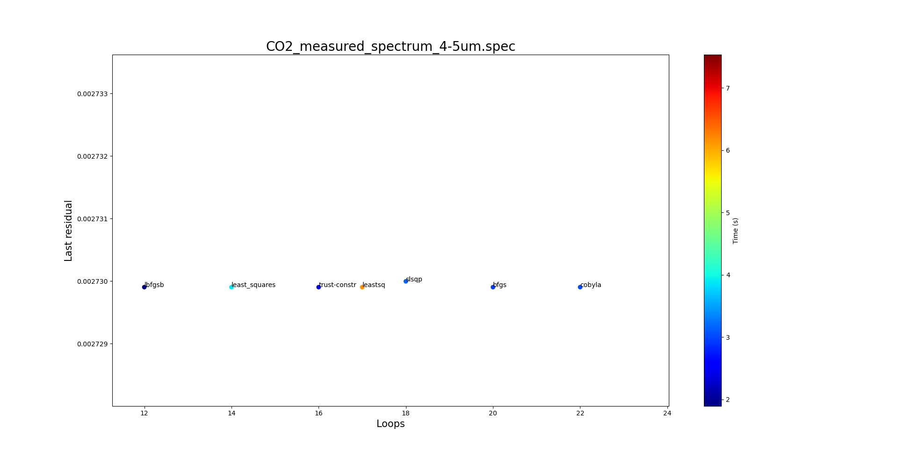

As my fitting module has completed, now I am clear to start the benchmarking process. Initially, I planned to do it on 4 categories: large, small, LTE and non-LTE. But then, Mr. Erwan's words helped me realize that my classification was somehow not ideal for this, as he said:

> The first need is not fitting performance, its a good fitting interface they would work on every typical condition.
>
> Do not wasting time trying to determine a perfect threshold or categories.
>
> Work on real-life examples. CO2 4.2 - 5 µm is one.
>
> CO2 bandhead (the Single Temperature fit example) is another one.
>
> Works on the improving the fits from these real-life examples,
> and - maybe - you'll generalize to categories/classifications eventually.

To be honest, I have been thinking about changing my project timeline and objectives a little bit. Initially, I proposed the timeline in which I would spend 1 week for making the module, and 4 weeks to conduct benchmarking on 4 types of spectrum (large, small, LTE, non-LTE). But then, I encountered a lot of difficulties in conducting the fitting process, which significantly delays my fitting module to be completed in the end of week 3. Along with Mr. Erwan's suggestions, after careful considerations, I have decided to reduce the category to only 2 groups of LTE and non-LTE spectra, and propose a new timeline based on that with my mentors, which successfully acquired their approvals. The new timeline is:

- Week 4 (this week): conduct benchmarking process on LTE spectra.
- Week 5: conduct benchmarking process on non-LTE spectra.
- Week 6: implement the fitting module and fitting models into RADIS codebase, finish any documentations, create a 101 tutorial, and prepare for first evaluation.

For this new timeline, the last week is going to be the toughest time ever! But I will try my best to catch up with the deadlines once and for all. I must admit that after half the first phase, I realized that my expected timeline in my project proposal - derived from my initial understandings of RADIS and fitting - is quite not applicable. As Mr. Minou - one of my mentors, said:

> Don't worry about changing the objectives . Some difficulties usually come up only when the project begins and cannot
> be easily anticipated. New directions seem fine to me and you are on the right path.

As well as Mr. Erwan:

> Just keep on progressing on the project as you do, reevaluating needs if needed.

 I have more confidence in keeping on with my plan. This new approach, hopefully, will allow me to finish implementing the fitting module into RADIS by the end of first phase. Quite an intensive experience for me but, let's go anyway! So here are the benchmarking results for our LTE experimental spectra, in which I will focus on comparison between fitting methods, and between refinement pipelines.

 ## 1. Fitting method benchmarking

 ### 1. `CO2_measured_spectrum_4-5um.spec`

 The ideal of benchmarking result is to test and assess under what conditions, such as fitting method, pipeline, refinement, etc., the fitting process can achieve a stable and robust result. Firstly, I want to test the fitting method and see which ones are the best to put into the module as the default method. As we use LMFIT.Minimizer, we have 23 fitting methods in total:

- `leastsq`: Levenberg-Marquardt (default).
- `least_squares`: Least-Squares minimization, using Trust Region Reflective method.
- `differential_evolution`: differential evolution.
- `brute`: brute force method.
- `basinhopping`: Basin-hopping method.
- `ampgo`: Adaptive Memory Programming for Global Optimization.
- `nelder`: Nelder-Mead.
- `lbfgsb`: Limited-memory Broyden–Fletcher–Goldfarb–Shanno (L-BFGS-B).
- `powell`: Powell's method.
- `cg`: Conjugate-Gradient.
- `newton`: Newton-Conjugate-Gradient.
- `cobyla`: Cobyla.
- `bfgs`: Broyden–Fletcher–Goldfarb–Shanno (BFGS).
- `tnc`: Truncated Newton.
- `trust-ncg`: Newton-Conjugate-Gradient trust-region.
- `trust-exact`: nearly exact trust-region.
- `trust-krylov`: Newton's Generalized Lanczos Trust-Region (GLTR).
- `trust-constr`: trust-region for constrained optimization.
- `dogleg`: Dog-leg trust-region.
- `slsqp`: Sequential Linear Squares Programming.
- `emcee`: Maximum likelihood via Monte-Carlo Markov Chain.
- `shgo`: Simplicial Homology Global Optimization.
- `dual_annealing`: Dual Annealing optimization.

In this list, there are 5 methods - `newton`, `trust-ncg`, `trust_exact`, `trust-krylov` and `dogleg` - that require Jacobian function to work, which adds more complexity into our fitting process and codebase, hence I remove them from the benchmark and never use them again. There are also `emcee` method that, for some unknown reasons, the fitting procedure never stops even after passing the loop limit, thus I have to remove it. Now we have 17 methods left that are stable enough to compare. Additionally, I set the max number of fitting loops as 200, so this means that any method that have equal of higher than 200 loops means that they are most likely unable to stop.

The result for this method-comparing benchmark can be found in [this JSON file](./method_comparison.txt).

| Method                 | Last residual         | Number of loops | Processing time (s) |
| :--------------------- | :-------------------: | :-------------- | :-----------:       |
| leastsq                | 0.0027299042272073103 | 17              | 6.128568887710571   |
| least_squares          | 0.0027299046347610202 | 14              | 3.8792104721069336  |
| differential_evolution | 0.0027299042330808853 | 48              | 7.211840629577637   |
| brute                  | 0.002784721834568091  | 20              | 3.13600492477417    |
| basinhopping           | 0.003047172548222827  | 201             | 31.650216579437256  |
| ampgo                  | 0.002730133209493655  | 201             | 36.60996413230896   |
| nelder                 | 0.0027299042330808853 | 48              | 7.532714605331421   |
| lbfgsb                 | 0.002729904381527972  | 12              | 1.8955962657928467  |
| powell                 | 0.0027299042271944525 | 38              | 6.310025691986084   |
| cg                     | 0.002729904692232839  | 34              | 5.223567724227905   |
| cobyla                 | 0.0027299044752413077 | 22              | 3.028048515319824   |
| bfgs                   | 0.002729904235170728  | 20              | 2.9560532569885254  |
| tnc                    | 0.0027299042284574205 | 36              | 5.905533313751221   |
| trust-constr           | 0.0027299042271945353 | 16              | 2.3700413703918457  |
| slsqp                  | 0.0027299969016334855 | 18              | 3.160074472427368   |
| shgo                   | 0.002729904227233636  | 32              | 6.185185194015503   |
| dual_annealing         | 0.02216192419896799   | 201             | 32.40411591529846   |

_(It is important to remember that this result might differ for each run, but rest assure the common trend is unchanged)_

As you can see from the data above, we have `basinhopping`, `ampgo` and `dual_annealing` jumping out of the loop limit of 200, and it's totally not a good thing, which I would like to exclude them out for the sake of better visualization. Then, in order to compare the rest of 14 methods, I have a scatter plot below in which I focus on analyzing the `last_residual` - indicator of accuracy - on the horizontal axis, and `loops` - indicator of fitting iterations needed - on the vertical axis. As `time` is heavily influenced by the computational capacity of each device, I don't prioritize it than other two criteria in the result assessment, and thus it is indicated by color code.

If we zoom in the best 8 cases marked by the red rectangle above:

In the zoomed version, we can see that, 