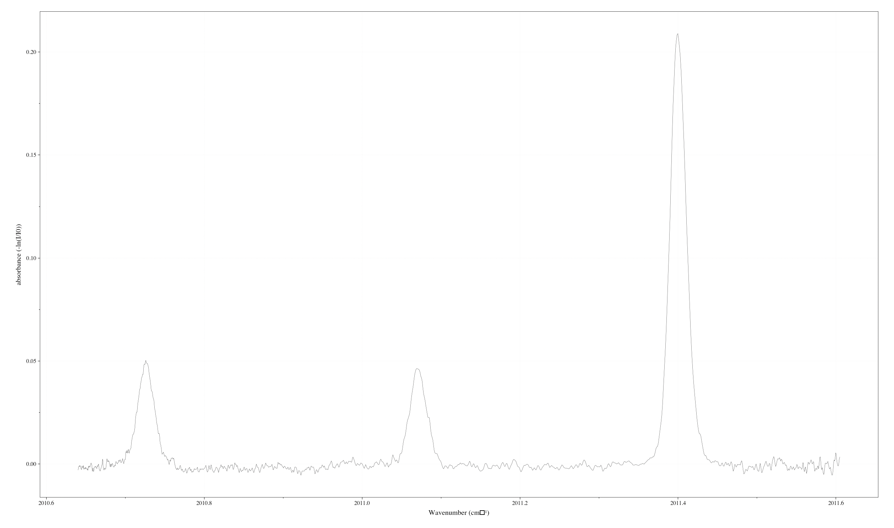
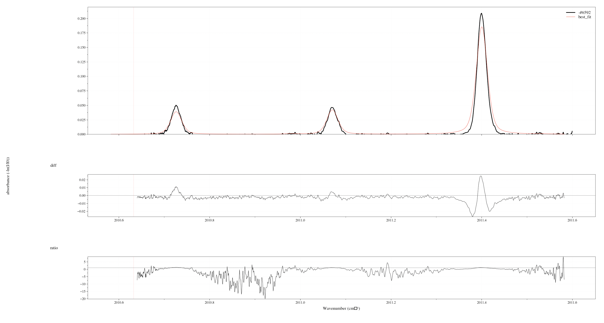

For now, my priority is to focus on extensive user-testing cases from real-life experimental spectra, instead of the synthetic ones in first phase of the project. One of the very first experimental spectra I get, is from Mr. Nicolas MinesiMinesi, or Mr. Minou, a Post-doctoral Researcher at Universify of California, L.A. He specializes in laser spectroscopy and also one of my mentors in RADIS.

### 1. The spectrum

Mr. Minou introduced an absorbance CO spectrum near 2011 cm-1. He stored the data in a MAT (Matlab) file, which is extracted by this script:

````python
fileName = "1857_VoigtCO_Minesi.mat"
data =  scipy.io.loadmat(fileName, simplify_cells=True)['CO_resu_Voigt']
index = 20
s_experimental = Spectrum.from_array(
    data['nu'], 
    data['A_exp'][:,index], 
    'absorbance', 
    wunit='cm-1', 
    unit=''
) # adimensioned
````

With this, I acquire the experimental spectrum as below:



And then, soon enough, I have also acquired his ground-truth data, which are fed to the JSON structures:

````python
# Experimental conditions which will be used for spectrum modeling. Basically, these are known ground-truths.
experimental_conditions = {
    "molecule" : "CO",          # Molecule ID
    "isotope" : "1",            # Isotope ID, can have multiple at once
    "wmin" : 2010.6,            # Starting wavelength/wavenumber to be cropped out from the original experimental spectrum.
    "wmax" : 2011.6,            # Ending wavelength/wavenumber for the cropping range.
    "wunit" : "cm-1",           # Accompanying unit of those 2 wavelengths/wavenumbers above.
    "pressure" : 1,             # Partial pressure of gas, in "bar" unit.
    "path_length" : 10,         # Experimental path length, in "cm" unit.
    "wstep" : 0.001,
    "databank" : "hitemp"       # Databank used for calculation. Must be stated.
}

# List of parameters to be fitted.
fit_parameters = {
    "Tgas" : 7170,              # Fit parameter, accompanied by its initial value.
    "mole_fraction" : 0.07,     # Species mole fraction, from 0 to 1.
    "offset" : "0 cm-1"         # Experimental offset, must be a blank space separating offset amount and unit.
}

# List of bounding ranges applied for those fit parameters above.
bounding_ranges = {
    "Tgas" : [2000, 9000],      # Bounding ranges for each fit parameter stated above. You can skip this step, but not recommended.
    "mole_fraction" : [0, 1],   # Species mole fraction, from 0 to 1.
    "offset" : [-0.1, 0.1]      # Experimental offset, must be a blank space separating offset amount and unit
}

# Fitting pipeline setups.
fit_properties = {
    "method" : "lbfgsb",        # Preferred fitting method from the 17 confirmed methods of LMFIT stated in week 4 blog. By default, "leastsq".
    "fit_var" : "absorbance",   # Spectral quantity to be extracted for fitting process, such as "radiance", "absorbance", etc.
    "normalize" : False,        # Either applying normalization on both spectra or not.
    "max_loop" : 300,           # Max number of loops allowed. By default, 100.
    "tol" : 1e-20               # Fitting tolerance, only applicable for "lbfgsb" method.
}
````

During my attempt to fit this spectrum, several bugs have been found and addressed.

### 2. Improvements

#### a. Databank statement

Initially, the databank selection is hard-coded into my module, with `hitran` for LTE cases and `hitemp` for non-LTE cases. In this case, Mr. Minou's spectrum is an LTE one, but he used `hitemp` databank for calculation. Basically, for CO molecule, there are lines in `hitemp` databank that are missing in `hitran` databank, and thus the default `hitran` for LTE does not provide a good result for Mr. Minou's case.

Thus, I make an implementation that allows users to specify the databank to be fetched into SpectrumFactory with `fetch_databank`, by stating it directly in the script, as you can see above in `experimental_conditions`.

#### b. Allow `offset` to be fitted

Previously, as `offset` and `slit` are not parameters of `calc_spectrum()`, but instead post-calculation convolution steps, so I did not include them as fit parameters. Now `offset` is included and can be fitted as you can see above. As for `slit`, according to Mr. Minou, usually the users know their FTIR spectrometer's stats, and measure slit separately, so I have yet implemeted `slit` as fittable parameter.

### 3. Result

Finally, we can see a not-perfect-but-good-enough result:



With best-fit parameters:

- `Tgas` : 6657.56 K (initially 7000 K).
- `mole_fraction` : 0.052 (initially 0.05).
- `offset` : -0.0177 cm-1 (initially 0 cm-1).

And the fitting performance, which is really, really robust:

- Fitting method: L-BFGS-B.
- Number of fitting loops: 120.
- Total fitting time: 4.3125 s.

To explain the discrepancy between experimental and best-fit spectra, Mr. Minou suggests that, this is some of physical problems, as RADIS currently only uses the air broadening parameters while originally he did this experiment in Argon. Future updates on other molecules' broadening coefficients will be needed to increase the accuracy of these cases with non-air diluents.

And so that's it! My first complete case has done, and I have much better confidence in my fitting module, while being eager to confront other cases and gradually improve my module. This is such a good birthday evening.